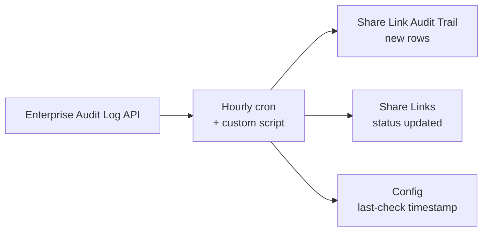

Every hour, a single custom script runs against Airtable's Enterprise Audit Log API and updates three tables in the same base. This page walks through that cycle end to end.

## Data flow

## The hourly run, step by step

<Steps>
  <Step title="Read the last check time" icon="clock-rotate-left">
    The script reads `Last Audit Check Time` from the single record in the `Config` table. If none exists yet, it defaults to 24 hours ago.
  </Step>
  <Step title="Page through the Audit Log API" icon="arrow-right-arrow-left">
    It calls `GET /v0/meta/enterpriseAccounts/{enterpriseAccountId}/auditLogEvents`, filtered with four repeated `filterByEventTypes` params (`enableShare`, `disableShare`, `configureShare`, `regenerateShare`), `pageSize=100`, and follows the returned `offset` for up to 10 pages per run, with a 200ms pause between pages to stay easy on the API.
  </Step>
  <Step title="Filter to genuinely new events" icon="filter">
    Each page is filtered again client-side against the last check timestamp, since the API filters by event type but not by time directly in this flow.
  </Step>
  <Step title="Group by share and calculate risk" icon="layer-group">
    Events are grouped by `modelId` (the share's ID). For each share, the script checks whether a matching record already exists in `Share Links`:

    <CardGroup cols={2}>
      <Card title="Existing share" icon="pen-to-square">
        The record's `Status`, `Last Modified`, `Last Event Type`, and `Change Count` are updated, and every event for that share becomes a new row in `Share Link Audit Trail`.
      </Card>

      <Card title="Unknown share" icon="circle-plus">
        A share that wasn't in the original CSV backfill. A new `Share Links` record is created, and the new audit row is tagged with the note _"New share link not in original CSV"_, exactly the kind of drift a point-in-time backfill will always eventually show.
      </Card>
    </CardGroup>
  </Step>
  <Step title="Write back in batches of 50" icon="boxes-stacked">
    Airtable's API caps batch writes at 50 records per call, so updates, new share links, and new audit entries are each chunked and written in a loop.
  </Step>
  <Step title="Update the checkpoint" icon="circle-check">
    `Config.Last Audit Check Time` is set to the current run's timestamp, and `Last Run Status` is set to `Success` (or the run logs an error and leaves the checkpoint where it was, so a failed run doesn't silently skip events).
  </Step>
</Steps>

## Why `viewShare` is deliberately excluded

<Note>
  The four tracked event types all represent a change to how a share behaves: turning it on or off, reconfiguring its restrictions, or rotating its ID. `viewShare` (someone simply opening a share link) doesn't change risk at all, it's usage, not configuration, and including it would have flooded the audit trail with noise that has nothing to do with what a security reviewer actually needs to see.
</Note>